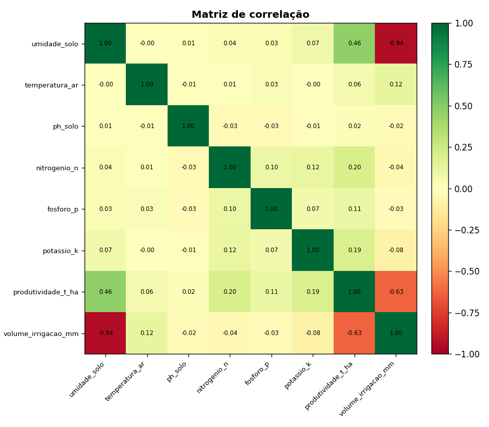
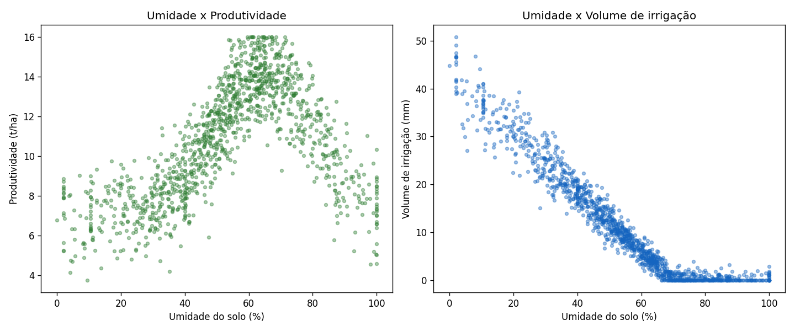
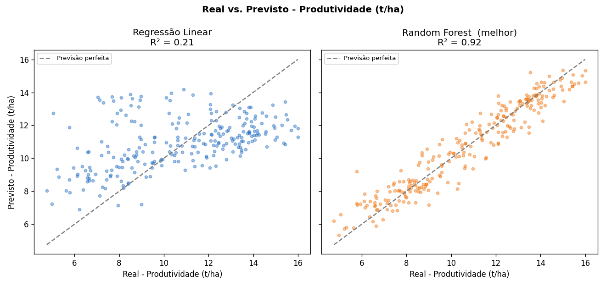
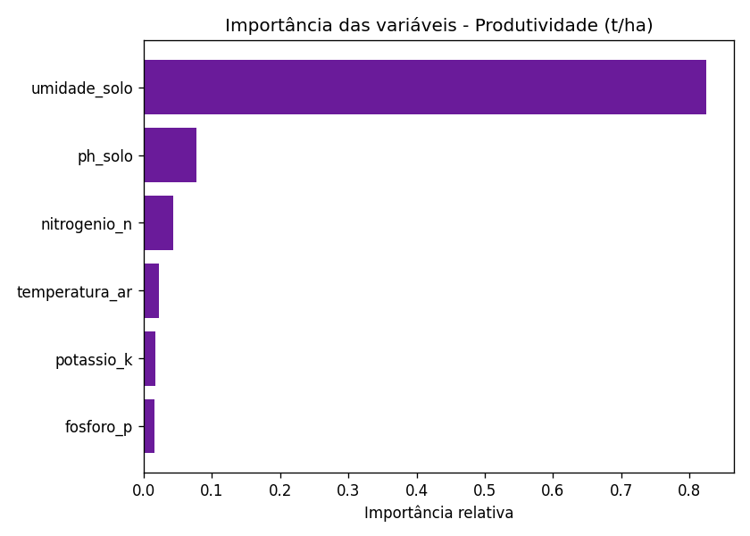

# FIAP - Faculdade de Informática e Administração Paulista

<p align="center">
  <a href="https://www.fiap.com.br/">
    
  </a>
</p>

<br>

# FarmTech Solutions - Fase 4
## Da Coleta à Predição: Inteligência Artificial aplicada ao Agronegócio

<br>
## 👨‍🎓 Integrantes

- Karina Garta Szewczuk  RM569309
- Maria Sabrina Feitosa da Silva  RM568714
- Nicolas Lima Apolinário  RM570741
- Roger Gabriel de Souza Jesus Costa  RM573659

<br>

## 👩‍🏫 Professores

### Tutor(a)

- Sabrina Otoni

### Coordenador(a)

- André Godói

<br>

## 📜 Descrição

Esta é a **Fase 4** do projeto **FarmTech Solutions**, no curso de Inteligência Artificial da FIAP. Nas fases anteriores construímos um sistema de irrigação inteligente para a cultura do **milho**, simulado no **Wokwi/ESP32** (sensores de umidade, pH via LDR e nutrientes NPK), e levamos os dados coletados para um **banco de dados Oracle** (tabela `DADOS_SENSORES`).

Nesta fase damos o passo que marca o início da **Agricultura Cognitiva**: aplicar **Inteligência Artificial** sobre esses dados. Com **regressão supervisionada (Scikit-Learn)**, passamos a prever a **produtividade esperada** e o **volume de irrigação recomendado** e, a partir daí, gerar **recomendações de manejo** (irrigação, fertilização e correção de pH).

Tudo isso aparece em um **dashboard interativo em Streamlit**, pensado para o gestor agrícola. O protótipo cobre o ciclo completo: dos **sensores IoT** ao **banco de dados**, e dos **modelos de Machine Learning** ao **dashboard de decisão**.

<br>

## 🎯 Objetivos da atividade

Construir um protótipo de **Assistente Agrícola Inteligente** que:

- Modele um **banco de dados simples** capaz de armazenar os dados dos sensores (reais da Fase 3 e simulados);
- Implemente modelos de **regressão supervisionada (Scikit-Learn)** para prever variáveis críticas do campo (produtividade e volume de irrigação);
- **Sugira ações futuras** de irrigação e manejo agrícola com base nas previsões;
- Apresente os resultados em um **dashboard interativo (Streamlit)**;
- Demonstre domínio técnico aplicando IA, ciência de dados e automação em um contexto prático do agronegócio.

<br>

## 🧩 Mapa das entregas

| Entrega | O que foi feito | Onde está |
|---|---|---|
| **Parte 1** · ML + Streamlit | Pipeline Scikit-Learn conectado a dashboard interativo com métricas, correlações e previsões | `ml/`, `dashboard/app.py` |
| **Parte 2** · Algoritmos preditivos | Regressão linear e Random Forest para produtividade e irrigação, mais as recomendações de manejo (MAE, MSE, RMSE, R²) | `ml/treinar_modelos.py`, `ml/recomendacoes.py` |
| **Ir Além 1** · IoT + Banco de dados | Modelo relacional (Oracle/SQLite) e pipeline de ingestão/atualização automática | `database/` |
| **Ir Além 2** · Dashboard analítico | Gráficos de correlação, previsões e tendências de produtividade interativas | `dashboard/app.py` |

<br>

## 🔄 Arquitetura da solução

```text
   SENSORES IoT (ESP32 / Wokwi - Fase 2/3)
   umidade · pH (LDR) · NPK · temperatura
                 │
                 ▼
   BANCO DE DADOS (Ir Além 1)
   Oracle SQL Developer  /  SQLite
   CULTURA 1 ──< N LEITURA_SENSOR
                 │
                 ▼
   DATASET (data/dataset_agricola.csv)
   55 leituras reais (Fase 3) + simulação agronômica
                 │
                 ▼
   MACHINE LEARNING (Parte 2 - Scikit-Learn)
   Regressão Linear + Random Forest
   alvos: produtividade (t/ha) e volume de irrigação (mm)
                 │
                 ▼
   DASHBOARD (Parte 1 + Ir Além 2 - Streamlit)
   métricas · correlações · previsões · recomendações · tendências
```

<br>

## 🗃️ Banco de dados (Ir Além 1)

A modelagem segue um modelo relacional simples com duas tabelas:

- **`CULTURA`** (dimensão): parâmetros agronômicos da cultura (faixas ideais de pH e umidade);
- **`LEITURA_SENSOR`** (fato): cada leitura dos sensores com as variáveis medidas e os alvos.

```text
CULTURA (id_cultura PK, nome, ph_ideal_min, ph_ideal_max, umidade_ideal_min, umidade_ideal_max)
                 │ 1
                 │
                 │ N
LEITURA_SENSOR (id_leitura PK, id_cultura FK, datahora, umidade_solo, temperatura_ar,
                ph_solo, nitrogenio_n, fosforo_p, potassio_k, valor_ldr,
                produtividade_t_ha, volume_irrigacao_mm, origem)
```

Arquivos:

- `database/01_criar_tabelas_oracle.sql`: DDL para o **Oracle SQL Developer** (continuidade da Fase 3);
- `database/02_consultas_oracle.sql`: consultas analíticas;
- `database/ingestao_iot.py`: pipeline de ingestão que simula os sensores gravando no banco.

O pipeline de ingestão suporta **Oracle** (biblioteca `oracledb`, usando as variáveis de ambiente `ORACLE_USER`, `ORACLE_PASSWORD`, `ORACLE_DSN`) e também **SQLite** (padrão, sem credenciais, ideal para a demonstração). Há dois modos:

- `--modo completo`: carrega todas as leituras de uma vez;
- `--modo stream`: insere leitura a leitura com intervalo, simulando a **ingestão e atualização automática** em tempo real.

```bash
# Carga completa em SQLite (recria as tabelas)
python database/ingestao_iot.py --reset

# Simulação de ingestão automática em tempo real
python database/ingestao_iot.py --modo stream --limite 20 --intervalo 0.5

# Usando Oracle (requer as variáveis de ambiente configuradas)
python database/ingestao_iot.py --banco oracle --reset
```

<br>

## 📊 Dataset

O arquivo `data/dataset_agricola.csv` é gerado pelo script `data/gerar_dataset.py` e combina:

- as **55 leituras reais** coletadas no Wokwi/ESP32 na Fase 3 (`origem = real`), convertidas para o novo schema;
- **1200 leituras simuladas** (`origem = simulado`), geradas com relações agronômicas coerentes para o milho.

A simulação foi necessária porque os dados da Fase 3 não possuíam um **alvo de produtividade** e tinham pouca variação para treinar uma regressão. Todo o processo é **reprodutível** (semente fixa).

| Coluna | Descrição |
|---|---|
| `umidade_solo` | Umidade do solo (%) |
| `temperatura_ar` | Temperatura do ar (°C) |
| `ph_solo` | pH do solo |
| `nitrogenio_n`, `fosforo_p`, `potassio_k` | Índices de nutrientes NPK (0–100) |
| `valor_ldr` | Leitura bruta do LDR (continuidade com a Fase 3) |
| `produtividade_t_ha` | **Alvo**: produtividade estimada (t/ha) |
| `volume_irrigacao_mm` | **Alvo**: volume de irrigação recomendado (mm) |
| `origem` | `real` (Fase 3) ou `simulado` |

<br>

## 🤖 Machine Learning (Parte 2)

Pipeline em `ml/treinar_modelos.py` usando **Scikit-Learn**:

1. **Tratamento de dados**: leitura do CSV, remoção de nulos e seleção de variáveis;
2. **Treino/validação**: divisão treino/teste (80/20) e validação cruzada (5 folds);
3. **Modelos comparados**: **Regressão Linear** (com `StandardScaler`) e **Random Forest**;
4. **Métricas**: MAE, MSE, RMSE e R²;
5. **Saída**: melhor modelo de cada alvo salvo em `ml/modelos/*.pkl`, métricas em `ml/modelos/metricas.json` e gráficos em `assets/`.

### Resultados obtidos

| Alvo | Modelo | R² | RMSE | MAE |
|---|---|---|---|---|
| Produtividade (t/ha) | Regressão Linear | 0.211 | 2.512 | 2.049 |
| Produtividade (t/ha) | **Random Forest** ✅ | **0.916** | **0.820** | **0.640** |
| Volume de irrigação (mm) | Regressão Linear | 0.884 | 3.710 | 2.818 |
| Volume de irrigação (mm) | **Random Forest** ✅ | **0.983** | **1.417** | **1.081** |

**Interpretação:** a produtividade depende de relações **não lineares** (faixas ideais de umidade, pH e temperatura), por isso o **Random Forest** supera com folga a regressão linear. Já o volume de irrigação tem comportamento mais **linear** (proporcional ao déficit de umidade), e a regressão linear já alcança um bom R² (0.88), mas o Random Forest ainda melhora o resultado.

### Bibliotecas utilizadas

- **pandas / numpy**: manipulação e análise de dados;
- **scikit-learn**: modelos de regressão, divisão treino/teste, validação cruzada e métricas;
- **joblib**: persistência dos modelos treinados;
- **matplotlib**: gráficos estáticos;
- **streamlit / plotly**: dashboard interativo.

<br>

## 🧠 Camada de recomendação

O módulo `ml/recomendacoes.py` traduz as previsões em **ações de manejo** para o gestor, com base em limiares agronômicos do milho:

- **Irrigação**: define a ação (irrigar com urgência, acionar, monitorar ou suspender) a partir da umidade atual e do volume previsto;
- **Fertilização**: identifica quais nutrientes (N, P, K) estão abaixo do nível adequado;
- **Correção de pH**: recomenda calagem (solo ácido) ou redução do pH (solo alcalino).

<br>

## 🖥️ Dashboard (Parte 1 + Ir Além 2)

Aplicação Streamlit em `dashboard/app.py`, com quatro abas:

1. **Visão Geral**: métricas de desempenho dos modelos (R², RMSE, MAE) e amostra dos dados;
2. **Correlações**: matriz de correlação interativa e gráficos de dispersão;
3. **Previsão & Recomendações**: sliders dos sensores que geram previsões **em tempo real** e as recomendações de manejo;
4. **Tendências**: produtividade por faixa de umidade, distribuição, relação com o pH e série temporal.

<br>

## 📁 Estrutura de pastas

```text
fase4/
├── README.md
├── requirements.txt
├── data/
│   ├── dados_fase3_reais.csv      # 55 leituras reais da Fase 3
│   ├── gerar_dataset.py           # gera o dataset (reais + simulado)
│   └── dataset_agricola.csv       # dataset final usado no ML
├── database/
│   ├── 01_criar_tabelas_oracle.sql
│   ├── 02_consultas_oracle.sql
│   └── ingestao_iot.py            # ingestão IoT (Oracle / SQLite)
├── ml/
│   ├── treinar_modelos.py         # pipeline de Machine Learning
│   ├── recomendacoes.py           # regras de manejo
│   └── modelos/                   # modelos .pkl + metricas.json
├── dashboard/
│   └── app.py                     # dashboard Streamlit
├── documents/
│   └── relatorio_fase4.md         # relatório técnico da fase
└── assets/                        # gráficos gerados e logo
```

<br>

## 🔧 Como executar

### Pré-requisitos

- Python 3.10+
- (Opcional) Oracle SQL Developer + biblioteca `oracledb`, caso queira usar o Oracle.

### Passo a passo

```bash
# 1. Instalar dependências
pip install -r requirements.txt

# 2. Gerar o dataset (reais + simulado)
python data/gerar_dataset.py

# 3. Treinar os modelos de regressão
python ml/treinar_modelos.py

# 4. Popular o banco de dados (SQLite por padrão)
python database/ingestao_iot.py --reset

# 5. Abrir o dashboard
streamlit run dashboard/app.py
```

> Observação: se a pasta do projeto estiver em um disco de rede que não suporta o travamento de arquivos do SQLite, defina o caminho do banco com a variável de ambiente `FARMTECH_SQLITE` (ex.: `export FARMTECH_SQLITE=~/farmtech.db`).

<br>

## 📈 Gráficos gerados

### Matriz de correlação



### Dispersão das variáveis



### Real vs. Previsto: Produtividade

Comparação dos dois modelos lado a lado. A Regressão Linear (R² = 0,21) espalha os pontos longe da diagonal, enquanto o Random Forest (R² = 0,92) fica próximo dela, o que justifica a escolha do modelo não linear.



### Importância das variáveis: Produtividade



<br>

## 🎥 Vídeos demonstrativos

Para publicar, suba cada vídeo (por exemplo no YouTube como **"não listado"**) e troque `URL_AQUI` pelo link correspondente.

| Entrega | Vídeo |
|---|---|
| Parte 1 (ML + Streamlit) | [▶ Assistir](URL_AQUI) |
| Parte 2 (algoritmos preditivos) | [▶ Assistir](URL_AQUI) |
| Ir Além 1 (IoT + banco) | [▶ Assistir](URL_AQUI) |
| Ir Além 2 (dashboard analítico) | [▶ Assistir](URL_AQUI) |

<br>

## 🗃️ Histórico de lançamentos

### 1.0.0 - 18/06/2026

- Pipeline de Machine Learning (Scikit-Learn) com regressão linear e Random Forest;
- Dashboard interativo em Streamlit (métricas, correlações, previsões e tendências);
- Modelagem do banco de dados e pipeline de ingestão IoT (Oracle/SQLite);
- Camada de recomendação de manejo agrícola;
- Relatório técnico da fase.

<br>

## 📋 Licença

Este projeto segue o modelo acadêmico da FIAP e foi desenvolvido exclusivamente para fins educacionais.

MODELO GIT FIAP por FIAP está licenciado sob Attribution 4.0 International.
